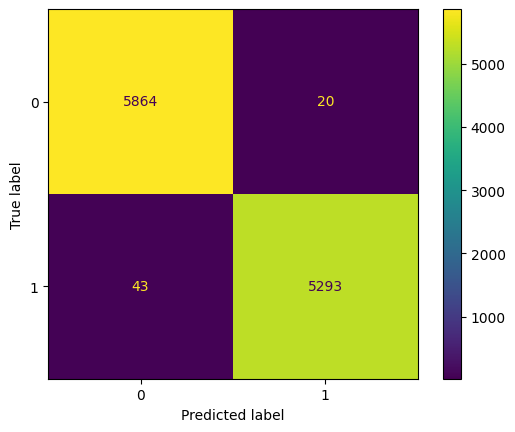
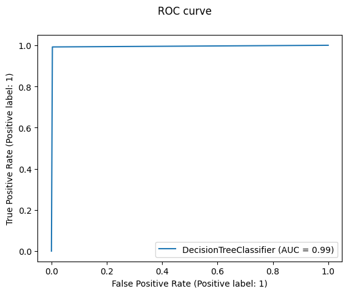

<h1 align="center">Fake News Prediction System</h1>

  

  
  
  
  
  
  
  
  

  

    Badge <a href="https://shields.io/">Source</a>
  

  <h2>Authors</h2>
  <ul>
    <li><a href="https://github.com/luisosorio3214">@luisosorio3214</a></li>
  </ul>

  <h2>Table of Contents</h2>
  <ul>
    <li><a href="#business-problem" target="_parent">Business Problem</a></li>
    <li><a href="#data-source">Data Source</a></li>
    <li><a href="#methods">Methods</a></li>
    <li><a href="#tech-stack">Tech Stack</a></li>
    <li><a href="#nlp">Natural Language Processing</a></li>
    <li><a href="#quick-glance">Quick glance at the results</a></li>
    <li>Lessons learned and recommendation</li>
    <li>Limitation and what can be improved</li>
    <li>Run Locally</li>
    <li>Explore the notebook</li>
    <li>Deployment on streamlit</li>
    <li>App deployed on streamlit</li>
    <li>Repository structure</li>
    <li>Contribution</li>
    <li><a href="#license">License</a></li>
  </ul>

  <section id="business-problem">
    <h2>Business Problem</h2>
    

      This app predicts if a news article contains misinformation which can mislead the public and bring social conflicts. In era of technology and social media, fake news has been more of an issue it has become quite difficult to distinguish the validity of the news. The danger of fake news can manipulate people's perception of reality, influence politics, and promote false advertising. This app will predict the probability of the news article of containing fake news. This app is intended for everyone in which the article yyou reading is in question and want to investigate further before taking anything at face-value. 
    

  </section>

  <section id="data-source">
    <h2>Data Source</h2>
    <ul>
      <li><a href="https://drive.google.com/drive/folders/1UzBdoQFqTJGllGCyodt_ny6x9aTENdGv?usp=share_link">My Google Drive</a></li>
    </ul>
  </section>

  <section id="methods">
    <h2>Methods</h2>
    <ul>
      <li>Exploratory Data Analysis</li>
      <li>Text Cleaning using Regex</li>
      <li>Term Frequency-Inverse Document Frequency</li>
      <li>Modeling</li>
      <li>Deployment</li>
    </ul>
  </section>

  <section id="tech-stack">
    <h2>Tech Stack</h2>
    <ul>
      <li>Python (Refer to requirements.txt for the packages used in this project)</li>
      <li>Streamlit (Interface for model)</li>
      <li>Google Cloud (Data Storage)</li>
    </ul>
  </section>

  <section id="nlp">
    <h2>Natural Language Processing</h2>
    

      Since we are given a data frame consisting of observations of articles, in order to implement our machine learning models which only underestand numbers we have to figure out how to convert our texts into specific mathematical terms. In other words we must tokenize our words so we are able to extract meaning or a pattern for our specific use case. Recall the goal is to determine whether an article contains fake news or not thus we should consider tokenizing words rather than senetences since theres various ways we tokenize text. I ended up choosing a vectorizer called TF-IDF (Term Frequency-Inverse Document Frequency) which captures the importance of a word in a document relative to a corpus of documents. Before applying the vectorizer, we clean the text using regex and got rid of special characters or words that provide no special use case in our specific prediction. Now here is a step-by-step explanation on how TF-IDF vectorization works:
      <ol>
        <li>Term Frequency (TF): TF measures the importance of a term within a document. It calculates the frequency of a term (word) in a document divided by the total number of terms in that document. The assumption is that the more frequently a term appears in a document, the more important it is.</li>
        <li>Inverse Document Frequency (IDF): IDF measures the rarity or uniqueness of a term across the entire corpus of documents. It is calculated by taking the total number of documents in the corpus divided by the number of documents that contain the term. IDF assigns higher weights to terms that are less common in the corpus, as they are considered more informative or distinctive.</li>
        <li>TF-IDF Calculation: The TF-IDF score for a term in a document is obtained by multiplying the TF value with the IDF value for that term. This process is repeated for all terms in each document, resulting in a numerical representation of the document based on the importance of its terms relative to the entire corpus.</li>
        <li>Vectorization: After calculating the TF-IDF scores, the TF-IDF vectorizer converts each document into a vector. Each component of the vector represents the TF-IDF score for a specific term in the document.</li>
      </ol>
    

  </section>

  <section id="quick-glance">
    <h2>Quick Glance at the Results</h2>
    

      Confusion Matrix of Decision Tree Classifier.
      
    

    

      ROC curve of Decision Tree Classifier.
      
    

    

      Top  3 models (with default hyper-parameters)
      <table style="width:100%">
        <tr>
          <th>Model</th>
          <th>Accuracy</th>
        </tr>
        <tr>
          <td>Logistic Regression</td>
          <td>98%</td>
        </tr>
        <tr>
          <td>Decision Tree</td>
          <td>99%</td>
        </tr>
        <tr>
          <td>Gradient Boosting</td>
          <td>99%</td>
        </tr>
      </table>
    

  </section>

  <section id="license">
    <h2>License</h2>
    

      MIT License

Copyright (c) 2022 Stern Semasuka

Permission is hereby granted, free of charge, to any person obtaining a copy
of this software and associated documentation files (the "Software"), to deal
in the Software without restriction, including without limitation the rights
to use, copy, modify, merge, publish, distribute, sublicense, and/or sell
copies of the Software, and to permit persons to whom the Software is
furnished to do so, subject to the following conditions:

The above copyright notice and this permission notice shall be included in all
copies or substantial portions of the Software.

THE SOFTWARE IS PROVIDED "AS IS", WITHOUT WARRANTY OF ANY KIND, EXPRESS OR
IMPLIED, INCLUDING BUT NOT LIMITED TO THE WARRANTIES OF MERCHANTABILITY,
FITNESS FOR A PARTICULAR PURPOSE AND NONINFRINGEMENT. IN NO EVENT SHALL THE
AUTHORS OR COPYRIGHT HOLDERS BE LIABLE FOR ANY CLAIM, DAMAGES OR OTHER
LIABILITY, WHETHER IN AN ACTION OF CONTRACT, TORT OR OTHERWISE, ARISING FROM,
OUT OF OR IN CONNECTION WITH THE SOFTWARE OR THE USE OR OTHER DEALINGS IN THE
SOFTWARE.

Learn more about <a href="https://choosealicense.com/licenses/mit/">MIT</a> license
    

  </section>

